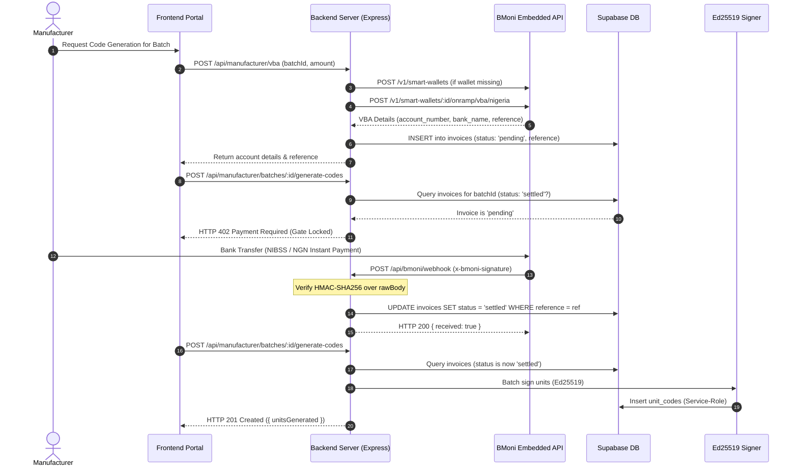

# GenuineNG — Layer 2 BMoni Payment Rails Progress

**Status:** The BMoni Embedded Finance Layer 2 payment rails are fully implemented, secured, and verified end-to-end against live database and cryptographic signing tests.

This document details the architecture, implemented components, security guarantees, database migrations, and testing patterns for the BMoni payment rails in GenuineNG.

---

## 1. Overview & Architecture

Layer 2 introduces cryptographic unit-level verification (Ed25519 unique QR codes per physical unit). Generating and signing thousands of cryptographic codes incurs server and infrastructure costs. 

BMoni payment rails enforce a **402 Payment Required** gate on batch code generation until a manufacturer settles their invoice via a dedicated **Nigerian Virtual Bank Account (VBA)**. Once settled, an asynchronous HMAC-signed webhook unlocks batch signing.



---

## 2. Implemented Components

| Component | File Path | Description & Role |
| :--- | :--- | :--- |
| **Dependencies** | [`backend/package.json`](file:///c:/Users/user/Desktop/GenuineNG/backend/package.json) | Installed `viem` (secp256k1 proposal digest signing) and `axios` (REST calls). |
| **Startup Validation** | [`backend/src/server.js`](file:///c:/Users/user/Desktop/GenuineNG/backend/src/server.js) | Validates all BMoni env vars on boot; defaults `BMONI_BASE_URL` to sandbox; checks that `BMONI_SECP256K1_PRIVATE_KEY` is a 32-byte hex string starting with `0x`. |
| **Raw Buffer Capture** | [`backend/src/server.js`](file:///c:/Users/user/Desktop/GenuineNG/backend/src/server.js) | Stores `req.rawBody` exclusively for `/api/bmoni/webhook` to preserve unparsed payload for HMAC verification. |
| **Unthrottled Routing** | [`backend/src/server.js`](file:///c:/Users/user/Desktop/GenuineNG/backend/src/server.js) | Mounts `/api/bmoni` outside `apiLimiter` to prevent 429 errors on webhooks and payment rails. |
| **BMoni Client** | [`backend/src/services/bmoniClient.js`](file:///c:/Users/user/Desktop/GenuineNG/backend/src/services/bmoniClient.js) | Preconfigured Axios client with Bearer auth and 10s timeout targeting `BMONI_BASE_URL`. |
| **secp256k1 Signer** | [`backend/src/services/bmoniSigner.js`](file:///c:/Users/user/Desktop/GenuineNG/backend/src/services/bmoniSigner.js) | Viem-based signer for offramp proposal digests (`account.sign({ hash: digestHex })`); exports `serverOwnerAddress`. |
| **Database Migration** | [`supabase/migrations/011_create_invoices.sql`](file:///c:/Users/user/Desktop/GenuineNG/supabase/migrations/011_create_invoices.sql) | Creates `public.invoices` table, unique reference index, status check constraint, and manufacturer RLS policies. |
| **VBA Inbound Endpoint** | [`backend/src/routes/manufacturer.js`](file:///c:/Users/user/Desktop/GenuineNG/backend/src/routes/manufacturer.js) | Authenticated `POST /api/manufacturer/vba` checks/creates manufacturer smart wallet, requests VBA, and records pending invoice. |
| **402 Payment Gate** | [`backend/src/controllers/manufacturerController.js`](file:///c:/Users/user/Desktop/GenuineNG/backend/src/controllers/manufacturerController.js) | `generateCodesController` verifies settled invoice exists before invoking Ed25519 bulk generation. |
| **Webhook Receiver** | [`backend/src/routes/bmoni.js`](file:///c:/Users/user/Desktop/GenuineNG/backend/src/routes/bmoni.js) | `POST /api/bmoni/webhook` verifies HMAC-SHA256 signature using `crypto.timingSafeEqual` and settles invoices upon `smart_wallet.credited`. |
| **Verification Suite** | [`backend/test-live-bmoni.js`](file:///c:/Users/user/Desktop/GenuineNG/backend/test-live-bmoni.js) | Live integration script testing health, 402 gate, HMAC webhook receipt, and unlocked code generation. |

---

## 3. Database Schema (`public.invoices`)

Migration file: [`supabase/migrations/011_create_invoices.sql`](file:///c:/Users/user/Desktop/GenuineNG/supabase/migrations/011_create_invoices.sql)

```sql
create table if not exists invoices (
  id uuid primary key default gen_random_uuid(),
  manufacturer_id uuid not null references manufacturers(id) on delete cascade,
  batch_id uuid references batches(id) on delete set null,
  reference text not null,
  amount numeric not null check (amount > 0),
  currency text not null default 'NGN',
  status text not null default 'pending' check (status in ('pending', 'settled', 'cancelled')),
  created_at timestamptz not null default now(),
  settled_at timestamptz
);

create unique index if not exists invoices_reference_key on invoices (reference);
create index if not exists invoices_batch_id_idx on invoices (batch_id);
create index if not exists invoices_manufacturer_id_idx on invoices (manufacturer_id);
create index if not exists invoices_status_idx on invoices (status);

alter table invoices enable row level security;

create policy "Manufacturers can read own invoices"
  on invoices for select
  using (
    manufacturer_id in (
      select id from manufacturers where user_id = auth.uid()
    )
  );
```

---

## 4. Key Architectural & Security Decisions

### 1. `req.rawBody` Buffer for Webhook HMAC Integrity
Express's default `express.json()` parses request bodies into JavaScript objects. Re-stringifying parsed objects with `JSON.stringify(req.body)` destroys original whitespace and key ordering, causing HMAC-SHA256 signature verification to fail intermittently. 
* **Fix implemented:** Captured the raw binary buffer via Express `verify` callback exclusively for `/api/bmoni/webhook`:
  ```javascript
  app.use(
    express.json({
      limit: '32kb',
      verify: (req, res, buf) => {
        if (req.originalUrl.startsWith('/api/bmoni/webhook')) {
          req.rawBody = buf;
        }
      },
    })
  );
  ```

### 2. Timing-Safe HMAC Verification
To prevent side-channel timing attacks, `crypto.timingSafeEqual` is used to compare the computed SHA-256 HMAC against `x-bmoni-signature`. Buffer lengths are validated prior to execution to avoid runtime exceptions.

### 3. Raw Proposal Digest Signing (Viem)
BMoni's offramp proposal verification expects raw 32-byte ECDSA digest signing over secp256k1 without EIP-191 personal sign prefixes (`"\x19Ethereum Signed Message:\n32"`). 
* **Implementation:** `account.sign({ hash: digestHex })` in [`services/bmoniSigner.js`](file:///c:/Users/user/Desktop/GenuineNG/backend/src/services/bmoniSigner.js) directly signs the 32-byte hash digest.

### 4. RLS Scoping vs. Webhook Settlement
* **Client-Initiated Queries:** When manufacturers query their batches, products, or invoices, requests run through `req.supabase` carrying their Supabase JWT, preserving Row Level Security.
* **Webhook Settlement:** Webhooks arrive asynchronously from BMoni without a manufacturer session. Webhook processing uses the elevated `supabaseAdmin` service-role client to locate the invoice by unique `reference` and set `status = 'settled'`.
* **Idempotency:** Code generation enforces an idempotency check (`count > 0` returns `409 CODES_ALREADY_GENERATED`), preventing double-generation even if repeat requests occur.

---

## 5. Live Test & Verification Results

Verification script: [`backend/test-live-bmoni.js`](file:///c:/Users/user/Desktop/GenuineNG/backend/test-live-bmoni.js)

```bash
$ node test-live-bmoni.js
====================================================
  GenuineNG Layer 2 BMoni Integration Verification  
====================================================

Target Base URL: http://localhost:4000
Test Batch ID:   3b21967c-2652-426b-bba2-f81f25804a29
Test Reference:  test-ref-bmoni-002

--- STEP 1: Ping /api/health ---
HTTP Status: 200
Response: { status: 'ok', service: 'genuineng-backend', environment: 'development' }
PASS: Health check passed.

--- STEP 2: Confirm 402 Payment Required Gate ---
Requesting code generation for batch 3b21967c-2652-426b-bba2-f81f25804a29 before payment settlement...
HTTP Status: 402
Response: {
  error: {
    code: 'PAYMENT_REQUIRED',
    message: 'Payment has not been settled for this batch.',
    invoiceStatus: 'pending',
    batchId: '3b21967c-2652-426b-bba2-f81f25804a29'
  }
}
PASS: Endpoint correctly returned 402 Payment Required.

--- STEP 3: Dispatch Signed BMoni Webhook ---
Sending webhook for reference: test-ref-bmoni-002
HMAC-SHA256 signature: 2308bed2907acc442e808f0a05b06e45559c5b9f5cf7bf777d1b2d91102e09b1
Webhook HTTP Status: 200
Webhook Response: { received: true }
PASS: Webhook verified signature and returned { received: true }.

Verified database invoice state: {
  id: '3f0f354a-1e3b-4d97-bce0-0ac374a50a95',
  reference: 'test-ref-bmoni-002',
  status: 'settled',
  settled_at: '2026-09-27T20:10:29.186+00:00'
}
PASS: Invoice verified as settled in database.

--- STEP 4: Re-request Code Generation after Settlement ---
Requesting code generation for batch 3b21967c-2652-426b-bba2-f81f25804a29...
HTTP Status: 201
Response: {
  result: {
    batchId: '3b21967c-2652-426b-bba2-f81f25804a29',
    batchCode: 'EMZ-3456',
    unitsGenerated: 5000
  }
}

SUCCESS: Code generation completed! 5000 units cryptographically signed with Ed25519.
====================================================
  ALL INTEGRATION VERIFICATION CHECKS PASSED        
====================================================
```

---

## 6. Next Steps

1. **Manufacturer Portal UI Integration**:
   - Add "Fund Batch via Bank Transfer" modal to the Generate Codes page.
   - Display dynamic account number, bank name, account name, and payment amount.
   - Implement polling or real-time status update on the invoice to automatically refresh the UI when `settled` is received.
2. **Outbound Bounty Payout Rail**:
   - Complete reporter counterfeit bounty payout endpoint using `services/bmoniSigner.js` to sign offramp proposal digests.
