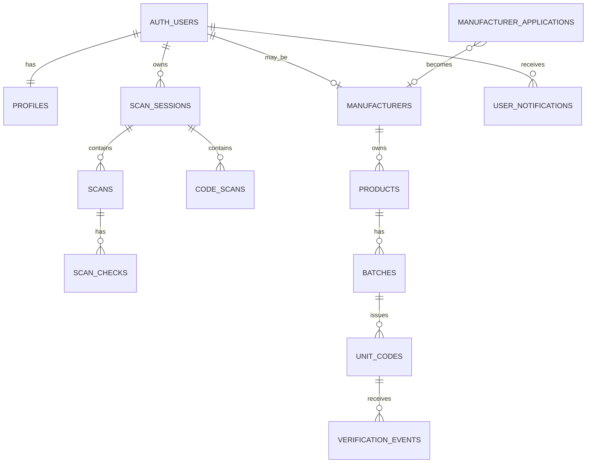

# GenuineNG Database Schema & Logic

> **Database:** Supabase/PostgreSQL
>
> **Purpose:** This document explains the current Layer 1 + Layer 2 schema, relationships, RLS boundaries, database functions, triggers, atomic scan logic and partner approval logic.

---

## 1. Schema philosophy

The current schema separates four concerns:

1. **Identity** — Supabase Auth + `profiles`.
2. **Consumer history** — `scan_sessions`, `scans`, `scan_checks`, `code_scans`.
3. **Manufacturer issuance** — `manufacturers`, `products`, `batches`, `unit_codes`.
4. **Verification and partner operations** — `verification_events`, `manufacturer_applications`, `admin_notifications`, `user_notifications`.

The database is not just storage. It also owns the operations that must be atomic or security-sensitive:

- saving a complete Registry scan;
- saving a complete GenuineNG QR scan;
- locking session type;
- incrementing/revoking public unit scans;
- recording manufacturer scans;
- approving manufacturer applications;
- enforcing row ownership with RLS.

---

## 2. Relationship map



---

## 3. Tables

## `profiles`

One row per Supabase Auth user.

| Column | Purpose |
|---|---|
| `id` | Same UUID as `auth.users.id` |
| `full_name` | User-facing profile name |
| `created_at` | Creation timestamp |
| `updated_at` | Last profile update |

`handle_new_user()` automatically inserts this row after an Auth signup.

---

## `scan_sessions`

Top-level consumer history thread.

| Column | Purpose |
|---|---|
| `id` | Session UUID |
| `user_id` | Owner |
| `mode` | `registry_label` or `genuine_code` |
| `title` | Sidebar title |
| `pinned` | Sidebar ordering/control |
| `created_at` | Created timestamp |
| `updated_at` | Last child/session change |

### Critical rule

`mode` is immutable after creation. The `scan_sessions_lock_mode` trigger rejects changes.

This is the database version of the UI rule: one conversation/session can contain only one verification type.

---

## `scans`

One Layer 1 Registry result.

| Column | Purpose |
|---|---|
| `session_id` | Parent Registry session |
| `user_id` | Owner |
| `product_name` | Reviewed product name |
| `manufacturer_text` | Reviewed manufacturer |
| `registration_number` | Reviewed NAFDAC number |
| `expiry_printed` | User-facing expiry text |
| `expiry_normalized` | Normalized date used for check |
| `result_summary` | Small JSON summary, currently including verdict text |
| `checked_at` | Verification time |

---

## `scan_checks`

Individual Layer 1 check outcomes.

Allowed `check_key` values:

```text
registration
expiry
```

Allowed statuses:

```text
match
warning
unverified
not_checked
```

There is a unique `(scan_id, check_key)` constraint, so one Registry scan cannot have duplicate Registration or Expiry rows.

---

## `manufacturer_applications`

Public partner applications and approval-link state.

Core fields:

- `company_name`
- `contact_person_name`
- `business_email`
- `phone_number`
- `status`: `pending | approved | rejected`
- `reviewed_at`
- `manufacturer_id`

Secure email approval fields:

- `approval_token_hash`
- `approval_token_expires_at`
- `approval_token_used_at`

Only the token hash is stored. The raw token is sent in the approval URL.

A partial unique index prevents more than one pending application for the same lowercased email.

> Existing projects created before the email-approval patch must run `supabase/migrations/002_partner_email_approval_notifications.sql`. The clean baseline schema already contains these columns.

---

## `admin_notifications`

Backend/internal queue of partner-application notifications.

Current insert trigger records application metadata as JSON. This table is service-role only in the current release.

---

## `user_notifications`

Persistent in-app notifications for signed-in users.

| Column | Purpose |
|---|---|
| `user_id` | Recipient |
| `type` | e.g. `manufacturer_approved` |
| `title` | Notification heading |
| `message` | User-facing message |
| `action_path` | Internal route such as `/manufacturer` |
| `read_at` | Null until opened |
| `created_at` | Created timestamp |

RLS allows a user to select/update only their own notification rows.

---

## `manufacturers`

Approved/pending manufacturer identity attached to one Supabase Auth account.

| Column | Purpose |
|---|---|
| `user_id` | Auth account that owns the manufacturer workspace |
| `company_name` | Company identity |
| `contact_person_name` | Contact |
| `business_email` | Business email |
| `phone_number` | Business phone |
| `approved` | Manufacturer portal permission switch |
| `approved_at` | Approval timestamp |

`user_id` is unique: one Auth account maps to at most one manufacturer profile in this release.

---

## `products`

Permanent manufacturer product records.

Only current release fields:

- `manufacturer_id`
- `name`
- `category`
- `nafdac_number`

The product is created once and reused by multiple batches.

---

## `batches`

Production run under one product.

Fields:

- `product_id`
- `batch_code`
- `manufactured_date`
- `expiry_date`
- `units_produced`

Rules:

- `units_produced` must be `1..100000`;
- expiry cannot precede manufacture date;
- `(product_id, batch_code)` is unique.

---

## `unit_codes`

One row per physical product unit.

| Column | Purpose |
|---|---|
| `batch_id` | Parent batch |
| `unit_index` | 1-based unit position inside batch |
| `unit_id` | Globally unique GenuineNG unit identifier |
| `payload` | Signed payload JSON |
| `signature` | Ed25519 signature |
| `key_version` | Signing-key version |
| `status` | `active` or `revoked` |
| `public_scan_count` | Count used by anti-reuse logic |
| `revoked_reason` | Why unit was revoked |
| `revoked_at` | Revocation timestamp |
| `issued_at` | Generation timestamp |

Constraints protect both:

```text
unit_id unique
(batch_id, unit_index) unique
```

The revocation consistency check prevents an `active` unit from carrying a revocation timestamp or a `revoked` unit from lacking one.

---

## `verification_events`

Immutable scan-event ledger used for Layer 2 analytics.

Fields capture:

- `unit_id`
- `actor_type`: `public | manufacturer`
- optional `manufacturer_id`
- `result`: `genuine | not_genuine`
- `reuse_status`
- `public_scan_number`
- `unit_status_after`
- `scanned_at`

Public events must have a public scan number and no manufacturer ID. Manufacturer events must have a manufacturer ID and no public scan number.

---

## `code_scans`

Customer history copy of a Layer 2 result.

This is different from `verification_events`:

- `verification_events` is the authoritative issuer/security event ledger;
- `code_scans` is the signed-in user's history representation.

Stored fields include:

- signed payload/signature;
- signature validity;
- online verification state;
- Genuine/Not Genuine verdict;
- reuse state;
- public scan number;
- unit status;
- reason;
- product/manufacturer/batch information.

---

## 4. Session functions

## `save_label_scan(...)`

Atomic Layer 1 save.

```text
Authenticate auth.uid()
→ if no session: create registry_label session
→ if session exists: lock row and require registry_label mode
→ validate edited scan belongs to same user/session
→ insert new scans row
→ insert registration/expiry rows
→ if editing: delete old scan only after replacement succeeded
→ return sessionId + scanId
```

This transaction structure prevents empty sessions and avoids deleting the old result before the replacement exists.

## `save_code_scan(...)`

Atomic Layer 2 history save.

```text
Authenticate auth.uid()
→ if no session: create genuine_code session
→ if session exists: require genuine_code mode
→ insert code_scans row
→ return sessionId + scanId
```

---

## 5. Session triggers

### `prevent_scan_session_mode_change()`

Blocks updates that attempt:

```text
registry_label → genuine_code
or
genuine_code → registry_label
```

### `touch_scan_session_from_child()`

When a Registry scan or code scan is inserted/updated, the parent session's `updated_at` is refreshed. This keeps recently active sessions ordered correctly in the sidebar.

---

## 6. Public anti-reuse function

## `process_public_unit_scan(p_unit_id)`

This function uses `SELECT ... FOR UPDATE` on the unit row. That serialization is the core race-condition protection.

```text
Load and row-lock unit
→ nextScan = public_scan_count + 1

If already revoked:
    increment count
    result = not_genuine
    reuse = revoked

Else if nextScan == 1:
    result = genuine
    reuse = first_scan
    remain active

Else if nextScan == 2:
    result = genuine
    reuse = previously_scanned
    remain active

Else:
    result = genuine
    reuse = reuse_limit_reached
    status = revoked
    revoked_reason = public_scan_limit
    revoked_at = now()

Insert verification_events row
Return verdict/reuse/count/status
```

Because the third scan revokes only after being accepted, scan #3 is Genuine with `reuse_limit_reached`; scan #4 sees `status = revoked` and becomes Not Genuine.

The function is executable only by `service_role`, so a browser cannot directly increment/manipulate unit state through an RPC call.

---

## 7. Manufacturer verification function

## `record_manufacturer_unit_scan(p_unit_id, p_manufacturer_id)`

This function:

1. finds the unit and owning manufacturer through batch/product;
2. rejects a manufacturer that does not own the unit;
3. does not modify `public_scan_count`;
4. records `manufacturer_check` in `verification_events`;
5. returns Genuine for active unit, Not Genuine for revoked unit.

It is also service-role only.

---

## 8. Manufacturer statistics functions

### `get_manufacturer_product_stats(manufacturer_id)`

Returns per-product:

- batch count;
- codes issued;
- scan-event count.

It additionally checks that `auth.uid()` owns the approved manufacturer profile.

### `get_manufacturer_batch_stats(manufacturer_id)`

Returns batch metadata plus actual count of generated `unit_codes`.

That count drives `ready_to_generate`, `partial`, and `generated` UI states.

### `get_manufacturer_scan_activity(manufacturer_id)`

Aggregates per batch:

- units generated;
- total scans;
- public scans;
- manufacturer scans;
- genuine scans;
- not-genuine scans;
- reuse signals;
- revoked units.

---

## 9. Partner application functions

### `queue_partner_application_notification()`

After a new application row is inserted, a trigger creates an `admin_notifications` entry containing the submitted application metadata.

### `approve_manufacturer_application(application_id, user_id)`

Manual service-role helper retained for direct/manual approval workflows.

It:

- loads application;
- finds Auth user by business email if user ID not supplied;
- creates/updates manufacturer;
- sets `approved = true`;
- marks application approved.

### `approve_manufacturer_application_by_token(token_hash)`

Secure email-button approval function.

It locks the application row and validates:

- token exists;
- status is pending;
- token unused;
- token unexpired;
- Auth user exists for the business email.

Then it:

1. creates/updates approved `manufacturers` row;
2. marks application approved;
3. records `approval_token_used_at`;
4. creates a `user_notifications` row pointing to `/manufacturer`;
5. returns details needed for the approval-email response.

Only service-role can execute this function directly.

---

## 10. Row Level Security

All user/manufacturer data tables have RLS enabled.

### User-owned data

Authenticated user may access only rows tied to `auth.uid()`:

- `profiles`
- `scan_sessions`
- `scans`
- `scan_checks`
- `code_scans`
- `user_notifications`

### Manufacturer-owned data

Manufacturer access is verified through relationship joins:

```text
auth.uid()
→ manufacturers.user_id
→ products.manufacturer_id
→ batches.product_id
→ unit_codes.batch_id
→ verification_events.unit_id
```

The manufacturer must also be `approved = true`.

### Backend-only data

There are no browser-facing policies granting normal access to:

- `manufacturer_applications`
- `admin_notifications`

Those operations are routed through the backend service-role client.

---

## 11. Function permissions

### Authenticated browser-safe RPCs

```text
save_label_scan
save_code_scan
get_manufacturer_product_stats
get_manufacturer_batch_stats
get_manufacturer_scan_activity
```

The first two derive user identity from `auth.uid()`. Manufacturer stats also validate manufacturer ownership.

### Service-role-only RPCs

```text
process_public_unit_scan
record_manufacturer_unit_scan
approve_manufacturer_application
approve_manufacturer_application_by_token
```

These functions alter security-sensitive state and are not directly executable by `anon` or normal `authenticated` roles.

---

## 12. Indexes that matter operationally

| Index | Why it exists |
|---|---|
| `scan_sessions_user_updated_idx` | Fast sidebar ordering by user/pin/recent activity |
| `scans_user_session_created_idx` | Load Registry scans per user/session |
| `code_scans_user_session_created_idx` | Load QR scans per user/session |
| `products_manufacturer_idx` | Manufacturer product listing |
| `batches_product_idx` | Product → batches |
| `unit_codes_batch_idx` | Generation/export ordered unit access |
| `unit_codes_status_idx` | Fast revoked-unit filtering |
| `verification_events_unit_scanned_idx` | Unit scan history |
| `verification_events_actor_idx` | Actor/time analytics |
| `manufacturer_applications_pending_email_key` | One pending application per email |
| `manufacturer_applications_approval_token_hash_key` | Fast secure token lookup |
| `user_notifications_unread_idx` | Fast unread notification loading |

---

## 13. Reset and migration strategy

### Fresh database

Use:

```text
supabase/genuineng_schema.sql
```

This is the complete current baseline.

### Existing old GenuineNG database

Use:

```text
supabase/genuineng_reset.sql
→ supabase/genuineng_schema.sql
```

The reset intentionally drops GenuineNG application tables/functions while keeping Supabase Auth users intact.

### Existing database already on the new baseline, but created before partner email approval

Do **not** reset. Run:

```text
supabase/migrations/002_partner_email_approval_notifications.sql
```

That migration adds:

- approval token columns;
- `user_notifications`;
- token approval function and permissions.

The runtime error:

```text
Could not find the 'approval_token_expires_at' column of 'manufacturer_applications'
```

means this migration has not yet been applied to that database or the API schema cache has not refreshed after applying it.

---

## 14. Data ownership summary

```text
Consumer history
Auth user owns scan session
Session owns either Registry scans OR code scans

Manufacturer issuance
Auth user owns approved manufacturer
Manufacturer owns products
Product owns batches
Batch owns unit codes
Unit code owns verification events

Partner onboarding
Application starts independent of Auth user
Approval resolves business email → Auth user
Approved application becomes manufacturer
User receives notification
```

---

## 15. Database invariants to preserve

Do not weaken these rules during future changes:

1. Session mode is immutable.
2. Layer 1 and Layer 2 result rows never share the same session type.
3. Public QR scan mutation is atomic.
4. The third public scan revokes the individual unit only.
5. Manufacturer verification does not increment public count.
6. Unit generation remains unique by both unit ID and batch/index.
7. Security-sensitive RPCs remain service-role only.
8. Manufacturer RLS follows ownership all the way through product/batch/unit relationships.
9. Partner approval tokens are stored hashed, expire, and are one-use.
10. User notifications are readable only by their recipient.
