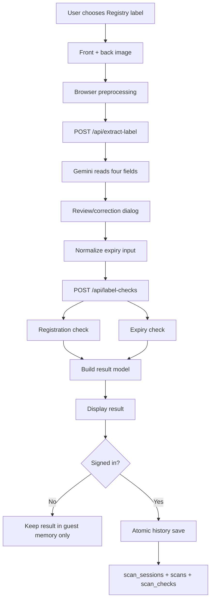
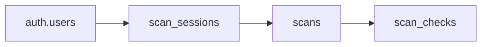

# GenuineNG Layer 1 — Registry Label Verification Architecture

> **Scope:** Consumer-facing product label checking using front/back packaging images, Gemini extraction, NAFDAC registration reference data, expiry validation, signed-in history, editing, read-aloud, and session locking.
>
> **Current release model:** Layer 1 does **not** declare a product fake simply because a registration record cannot be found. `Unverified` means the current reference source could not confirm the registration. Missing expiry information produces `Not checked`.

---

## 1. What Layer 1 is for

Layer 1 answers a narrow question: **what can GenuineNG verify from the information printed on the product label?**

It uses two checks:

1. **Registration check** — compares the printed NAFDAC registration number against the local Greenbook reference export and, where possible, cross-checks product/manufacturer identity.
2. **Expiry check** — evaluates the printed expiry date against the current date.

Layer 1 intentionally separates evidence from conclusions. A registration number can be `match`, `warning`, `unverified`, or `not_checked`; expiry can also be checked independently. The final copy is built from those outcomes rather than from a hidden percentage or score.

### Layer 1 does not do

- Ingredient analysis.
- Recall/batch verification.
- Tesseract OCR.
- A fake/genuine binary verdict based only on NAFDAC lookup.
- A blended confidence score.
- Offline verification.

---

## 2. End-to-end Layer 1 flow



The user can correct extracted fields before verification. Partial information is valid. If only one useful field is available, GenuineNG checks only what that field supports.

---

## 3. Session behavior

Layer 1 shares the signed-in workspace with Layer 2.

A new `/app` workspace starts with **Registry selected by default**, but the session is not locked until the first meaningful action.

### Lock rule

A Registry session becomes locked when the user:

- uploads a front/back image; or
- captures an image through the camera.

Once locked, the mode switch cannot change that working session to GenuineNG Code.

### New Check rule

`New Check` resets the working flow even if the browser is already on `/app`. `SignedWorkspacePage.jsx` increments `newCheckVersion`, which changes the React key passed to `LabelCheckFlow`. That remount clears local mode state and prevents the old session lock from surviving until refresh.

### Reopened history

A saved `registry_label` session reopens with:

- its previous Registry results;
- Registry mode selected;
- the mode locked;
- editing enabled on saved Registry results.

The database also prevents an existing session's mode from being changed later.

---

## 4. Frontend file structure

```text
frontend/
├── src/
│   ├── App.jsx
│   ├── main.jsx
│   ├── components/
│   │   ├── LabelCheckFlow.jsx
│   │   ├── CheckModeSwitch.jsx
│   │   ├── CameraCaptureDialog.jsx
│   │   ├── ExtractionReviewDialog.jsx
│   │   ├── FieldReviewForm.jsx
│   │   ├── OcrFailureDialog.jsx
│   │   ├── ResultView.jsx
│   │   ├── ScanCameraView.jsx
│   │   ├── NotificationBell.jsx
│   │   └── Icon.jsx
│   ├── pages/
│   │   ├── ScanPage.jsx
│   │   ├── GuestScanPage.jsx
│   │   └── SignedWorkspacePage.jsx
│   ├── services/
│   │   ├── api.js
│   │   ├── historyService.js
│   │   ├── labelPayload.js
│   │   ├── resultModel.js
│   │   ├── errorShape.js
│   │   └── supabase.js
│   ├── ocr/
│   │   └── imagePreprocess.js
│   ├── speech/
│   │   └── voice.js
│   └── styles/
│       └── index.css
└── public/
    ├── manifest.json
    ├── service-worker.js
    └── icons/
```

### `frontend/src/App.jsx`

Top-level routing and application state.

For Layer 1 it:

- sends public users from the landing page into `/scan`;
- sends authenticated users into `/app`;
- holds guest scan results in memory;
- tracks online/offline state and backend health;
- keeps Supabase Auth session state;
- exposes the install-as-app control.

It is not the verification engine. Its job is routing and app-shell coordination.

### `frontend/src/pages/ScanPage.jsx`

Public landing-page scan launcher.

It shows the Registry/GenuineNG Code mode switch and routes the Registry launcher into the guest Layer 1 flow. The first selected photo is passed upward to `App.jsx`, then into `/scan`.

### `frontend/src/pages/GuestScanPage.jsx`

Thin wrapper around `LabelCheckFlow` for unauthenticated users.

Guest results are not written to Supabase. They exist only in current browser memory until the route is left or refreshed.

### `frontend/src/pages/SignedWorkspacePage.jsx`

Owns authenticated history/session behavior.

Responsibilities:

- load `scan_sessions`;
- open `/app/:sessionId`;
- restore saved scans;
- save new Registry results;
- rename sessions;
- pin/unpin sessions;
- delete one session;
- clear all user history;
- reset the working flow for `New Check`;
- restore the session's saved mode.

It calls `historyService.js` rather than writing all history records directly.

### `frontend/src/components/LabelCheckFlow.jsx`

The main Layer 1 state machine.

Important state:

- `checkMode` — `registry` or `code`;
- `modeLocked` — prevents changing type after the first action;
- `stage` — `capture`, `reading`, `review`, `review_saved`, `checking`, or `result`;
- `photos` — prepared front/back images;
- `fields` — product name, manufacturer, registration number, expiry;
- `editingSavedScan` — distinguishes new scans from history edits.

Important transitions:

```text
capture
  ↓ both images ready
reading
  ↓ extracted data available
review
  ↓ user confirms/corrects
checking
  ↓ backend result
result
```

If extraction fails:

```text
reading
  ↓ failure / no usable fields
capture + extraction failure dialog
  ├─ Retake images
  └─ Enter information manually
```

Editing a saved Registry result switches to `review_saved`; verification runs again and the history layer replaces the old saved record through the atomic save function.

### `frontend/src/components/CameraCaptureDialog.jsx`

Captures a product image from the browser camera and returns it as a file to `LabelCheckFlow`.

### `frontend/src/components/ExtractionReviewDialog.jsx`

Review/correction modal shown after Gemini extraction or manual fallback. The user is expected to verify the printed details before GenuineNG performs its checks.

### `frontend/src/components/FieldReviewForm.jsx`

Renders the editable fields:

- Product name
- Manufacturer
- Registration number
- Expiry date

No field is individually mandatory; the flow only requires at least one useful label detail before checking.

### `frontend/src/components/OcrFailureDialog.jsx`

Handles a failed/empty Gemini read. It offers a clean choice between retaking the label images and manually entering the available information.

### `frontend/src/components/ResultView.jsx`

Presents Layer 1 results.

It renders:

- completion state;
- warnings;
- Registration outcome;
- Expiry outcome;
- plain-language verdict;
- edit action;
- copy action;
- voice playback;
- result timestamp.

### `frontend/src/ocr/imagePreprocess.js`

Despite the directory name, this is **not Tesseract OCR**. It is browser-side image preparation.

It:

- accepts JPEG/PNG/WebP;
- rejects unsupported types and very large originals;
- resizes the longest side to at most 1800px;
- draws against white;
- converts to WebP at controlled quality.

The prepared blobs are what the backend sends to Gemini.

### `frontend/src/services/api.js`

Layer 1 network boundary.

Relevant calls:

| Function | Endpoint | Purpose |
|---|---|---|
| `extractLabelFields()` | `POST /api/extract-label` | Send front/back images to Gemini extraction |
| `runLabelVerification()` | `POST /api/label-checks` | Run Registration + Expiry checks |
| `checkBackendHealth()` | `GET /api/health` | Show backend availability state |

### `frontend/src/services/labelPayload.js`

Normalizes user-entered expiry values before sending them to the backend.

Supported patterns include:

- `YYYY-MM-DD`
- `DD/MM/YYYY`
- `MM/YYYY`

Month/year-only dates are normalized to the last day of that month and the UI records a note explaining that assumption.

### `frontend/src/services/resultModel.js`

Converts backend check objects into the UI result model.

It defines:

- check titles and order;
- completion state;
- warnings;
- final explanatory verdict;
- clipboard formatting.

This is where the important wording rule is enforced in the UI: `Unverified` is presented as a source-confirmation limitation, not as proof of a fake product.

### `frontend/src/services/historyService.js`

Bridge between signed-in history UI, backend scan API, Supabase RPCs and direct RLS-protected session queries.

For Layer 1 it:

- lists sessions;
- loads Registry scans and their check rows;
- converts database rows back into `ResultView` objects;
- sends a new/edited result to `/api/scans`;
- manages rename, pin, delete and clear-history operations.

### `frontend/src/speech/voice.js`

Uses the browser Speech Synthesis API. It prefers `en-NG`, then `en-GB`, then another English voice. It reads the result, warnings, individual checks and verdict.

---

## 5. Backend file structure

```text
backend/src/
├── server.js
├── controllers/
│   ├── extractLabelController.js
│   ├── labelChecksController.js
│   └── scansController.js
├── routes/
│   ├── extractLabel.js
│   ├── labelChecks.js
│   └── scans.js
├── services/
│   ├── labelExtractor.js
│   ├── referenceData.js
│   ├── registrationMatcher.js
│   ├── geminiMatcher.js
│   ├── expiryChecker.js
│   └── resultBuilder.js
├── validators/
│   ├── labelInputValidator.js
│   └── scanInputValidator.js
├── middleware/
│   ├── authMiddleware.js
│   ├── validation.js
│   └── errorHandler.js
└── data/
    └── processed/reference_products.json

nafdac_greenbook_export.json
scripts/
├── fetch-nafdac-greenbook.js
└── validate-reference-data.js
```

### `backend/src/routes/extractLabel.js`

Multipart image endpoint.

Current boundary rules:

- JPEG/PNG/WebP only;
- maximum two files;
- 8MB backend limit per uploaded image;
- fields named `front` and `back`.

### `backend/src/controllers/extractLabelController.js`

Converts Multer files into the `{ buffer, mimeType, originalName }` shape expected by the extraction service, then calls `extractLabelFields()`.

### `backend/src/services/labelExtractor.js`

Gemini extraction service.

It extracts exactly four values:

```json
{
  "productName": null,
  "manufacturer": null,
  "registrationNumber": null,
  "expiryDate": null
}
```

Behavior:

- primary Gemini model first;
- retry transient failures/timeouts;
- fallback model after primary failure;
- parse only JSON;
- normalize empty strings to `null`;
- process front and back images concurrently;
- merge available fields;
- return extraction-unavailable rather than inventing fields.

### `backend/src/routes/labelChecks.js`

`POST /api/label-checks` boundary for Registry verification.

### `backend/src/middleware/validation.js`

Runs `validateLabelInput()` before the controller. Invalid shapes are rejected before service logic.

### `backend/src/validators/labelInputValidator.js`

Allows partial input but requires at least one usable detail. It validates string lengths and requires normalized expiry values to be real `YYYY-MM-DD` calendar dates.

### `backend/src/controllers/labelChecksController.js`

Small controller that delegates the actual work to `resultBuilder.js`.

### `backend/src/services/resultBuilder.js`

Runs the two checks independently:

```text
registrationMatcher.checkRegistration()
expiryChecker.checkExpiry()
```

It returns both outcomes even when one of them is `not_checked`.

### `backend/src/services/referenceData.js`

Loads `nafdac_greenbook_export.json` at server startup and creates an in-memory registration-number index.

Registration numbers are normalized by:

- trimming;
- uppercasing;
- removing punctuation/non-alphanumeric characters.

This makes common OCR formatting differences less likely to break a lookup.

### `backend/src/services/registrationMatcher.js`

Registration decision logic.

```text
No registration number
→ not_checked

Registration number not found
→ unverified
→ explicitly states that unverified does not mean fake

Registration number found, no identity fields
→ match registration number only

Registration number found + product/manufacturer supplied
→ Gemini identity comparison
   ├─ conflict → warning
   ├─ comparison unavailable → registration remains match, with limitation
   └─ plausible match → match
```

### `backend/src/services/geminiMatcher.js`

Secondary Gemini use. This is not label OCR; it compares the user's extracted/corrected product identity with the reference record while tolerating OCR noise and abbreviations.

Blank identity fields are explicitly ignored rather than treated as mismatches.

### `backend/src/services/expiryChecker.js`

Simple deterministic expiry check:

```text
No expiry → not_checked
Invalid normalized date → unverified
Date before today → warning
Today/future → match
```

### `backend/src/routes/scans.js` and `backend/src/controllers/scansController.js`

Authenticated history API.

Routes:

| Method | Route | Purpose |
|---|---|---|
| GET | `/api/scans` | List own Registry scans, optionally by session and including checks |
| GET | `/api/scans/:id` | Read one own scan + checks |
| POST | `/api/scans` | Atomically save a new/edited Registry result |
| DELETE | `/api/scans/:id` | Delete one Registry scan |

The POST route delegates the write to the `save_label_scan` database function. That prevents the old failure mode where an empty session could be created before the actual scan/check rows failed.

---

## 6. Registration source and data refresh

Primary source file:

```text
nafdac_greenbook_export.json
```

Supporting scripts:

- `scripts/fetch-nafdac-greenbook.js` — refresh workflow for the reference export.
- `scripts/validate-reference-data.js` — validates shape/quality of the exported dataset.

The backend reports the dataset generation timestamp in Registration result source text so a user can see that the match is based on a specific local reference snapshot.

---

## 7. Layer 1 history model



A Registry session has `mode = registry_label`.

A single session may contain multiple Registry checks. Each `scans` row stores the user-visible label fields and summary. Each `scan_checks` row stores one of exactly two check types:

- `registration`
- `expiry`

The database session-mode trigger and save RPC reject attempts to place Registry results inside a `genuine_code` session.

---

## 8. Guest vs signed-in behavior

| Capability | Guest | Signed in |
|---|---:|---:|
| Capture/upload label | Yes | Yes |
| Gemini extraction | Yes | Yes |
| Registration check | Yes | Yes |
| Expiry check | Yes | Yes |
| Correct extracted fields | Yes | Yes |
| Read result aloud | Yes | Yes |
| Persistent history | No | Yes |
| Rename/pin/delete history | No | Yes |
| Reopen saved result | No | Yes |
| Edit saved result and rerun | No | Yes |

---

## 9. Error handling

Layer 1 separates failure points so the UI does not collapse everything into one generic error.

### Image preparation errors

Handled in browser before upload.

### Gemini extraction errors

The backend retries transient requests and attempts a fallback model. If extraction still fails, the frontend preserves the workflow by offering manual entry.

### Verification errors

The review form stays available so the user does not lose corrected fields.

### History save errors

The result can be computed successfully even if persistence fails. The workspace reports that the check completed but history could not be confirmed.

### Connectivity

`App.jsx` watches both `navigator.onLine` and `/api/health`, allowing the UI to distinguish local network loss from backend unavailability.

---

## 10. Security boundary

Guest verification endpoints are intentionally public, but history is not.

History routes require a valid Supabase bearer token. `authMiddleware.js` validates it with Supabase Auth and creates a request-scoped Supabase client carrying the user's JWT, so database RLS remains active.

Layer 1 history RLS restricts users to their own:

- `scan_sessions`
- `scans`
- `scan_checks`

---

## 11. Layer 1 outcome language

Layer 1 should always preserve these distinctions:

| Outcome | Meaning |
|---|---|
| `Matched` | Available evidence matched the current source/check |
| `Warning` | Available evidence contains a concrete conflict/problem |
| `Unverified` | GenuineNG could not confirm the information from the current source |
| `Not checked` | Required input for that specific check was not available |

The Registry layer verifies printed information. It does **not** claim that a physical item is genuine merely because its printed registration number and expiry look valid.

---

## 12. Layer 1 maintenance rule

When changing Layer 1, keep these boundaries intact:

- UI capture/review belongs in `LabelCheckFlow` and its child components.
- Request formatting belongs in frontend services.
- Input validation belongs at API/database boundaries.
- Gemini extraction and identity comparison remain separate services.
- Registration and expiry remain independent checks.
- Persistent history must go through the atomic save path.
- Session type must never be changed after first action.
