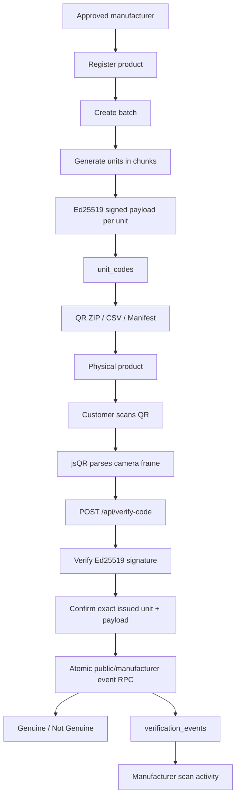
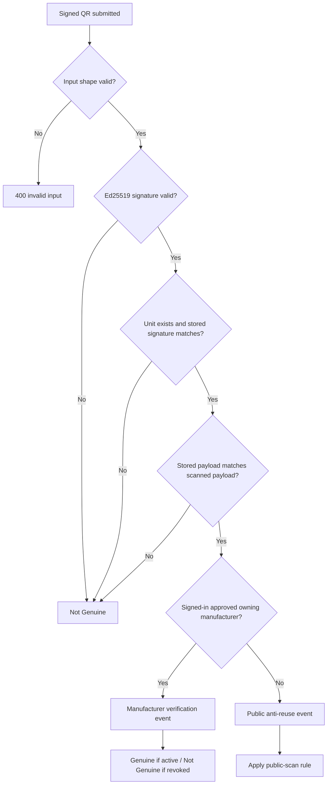

# GenuineNG Layer 2 — Signed Unit QR & Manufacturer Architecture

> **Scope:** GenuineNG-issued unit QR codes, Ed25519 signing, public verification, three-public-scan anti-reuse logic, manufacturer authentication/isolation, partner approval, products, batches, resumable unit generation, exports, scan activity and customer QR history.

---

## 1. What Layer 2 is for

Layer 2 answers a different question from Layer 1:

**Was this exact unit QR issued by GenuineNG, is its signature valid, is it present in issuance records, and is the unit still active?**

The result is deliberately binary:

- **Genuine**
- **Not Genuine**

Reuse is shown separately. There is no score or percentage.

Layer 2 is based on a chain of trust:

```text
Approved manufacturer
→ registered product
→ production batch
→ unique unit index
→ unique unit ID
→ signed payload
→ QR image
→ customer scan
→ signature + issuance + unit-status verification
```

---

## 2. Layer 2 system map



---

## 3. Consumer QR scan flow

The customer scanner is camera-first and uses one implementation.

### Before camera opens

The UI presents the compact GenuineNG Code panel and an **Open camera** action.

### Camera start

`CodeScanFlow.jsx` calls `navigator.mediaDevices.getUserMedia()`.

Default behavior:

- prefers `environment` / rear camera where available;
- targets 1280×720 ideal resolution;
- enumerates browser-visible cameras after permission is granted;
- supports integrated, USB and virtual cameras such as DroidCam;
- provides **Switch camera** when multiple video inputs are visible.

Opening the camera is the first meaningful Layer 2 action, so it locks a new signed-in session to GenuineNG Code mode.

### Continuous decoding

A hidden canvas receives frames from the live video. Roughly every 120ms:

1. current frame is copied into the canvas;
2. `jsQR` attempts decoding;
3. once a QR is read, the decode loop locks;
4. camera tracks stop;
5. QR content is parsed;
6. backend verification begins.

The consumer flow does not use pasted QR text or a customer-facing QR-image upload path.

---

## 4. QR payload format

Each QR contains JSON with two top-level values:

```json
{
  "payload": {
    "productId": "uuid",
    "batchId": "uuid",
    "unitId": "batch-uuid-000001",
    "unitIndex": 1,
    "keyVersion": "1"
  },
  "signature": "base64-ed25519-signature"
}
```

`frontend/src/crypto/verifySignature.js` parses and canonicalizes the QR shape before it is sent to the backend. The browser does not make the final authenticity decision.

---

## 5. Verification decision path

`POST /api/verify-code` is public but accepts optional authentication.



The backend validates both cryptographic and database evidence. A mathematically valid signature alone is not enough; the unit must also be confirmed in issuance records with the same stored payload/signature.

---

## 6. Three-public-scan anti-reuse system

The public reuse counter is held on each `unit_codes` row.

| Public scan | Result | Reuse state | Unit after scan |
|---:|---|---|---|
| #1 | Genuine | `first_scan` | active |
| #2 | Genuine | `previously_scanned` | active |
| #3 | Genuine | `reuse_limit_reached` | revoked |
| #4+ | Not Genuine | `revoked` | revoked |

### Important properties

- Revocation applies to one `unit_id`, not the whole batch.
- The global Ed25519 key is not revoked when one unit reaches the limit.
- `revoked_reason = public_scan_limit` records why the unit was deactivated.
- `revoked_at` records when the unit changed state.
- Public scan mutation is handled inside a row-locking PostgreSQL function, avoiding race conditions where simultaneous scans could bypass the counter.

### Manufacturer scans

If the caller is authenticated as the **approved manufacturer that owns the unit**, the backend records a `manufacturer_check` event instead.

Manufacturer checks:

- do not increment `public_scan_count`;
- do not trigger the public reuse limit;
- still appear in manufacturer activity;
- return Genuine only when that unit is active.

An authenticated manufacturer scanning another manufacturer's unit is not treated as the owner and does not receive privileged manufacturer behavior.

---

## 7. QR generation and signing

### Unit generation model

Maximum batch size: **100,000 units**.

Generation runs in chunks of at most **1,000 units per request**.

For each unit:

1. `unitIndex` is assigned from the current stored count + 1.
2. `unitId` is derived from the batch UUID + padded unit index.
3. payload is constructed in fixed key order.
4. backend signs the canonical payload using the Ed25519 private key.
5. payload, signature and key version are inserted into `unit_codes`.

Uniqueness constraints on both `unit_id` and `(batch_id, unit_index)` protect against accidental duplication.

### Resumability

Generation status is read from the actual count of `unit_codes` rows.

If generation stops after 29,000 of 50,000 units:

```text
stored count = 29,000
next request starts at unit 29,001
```

The browser loops over chunk requests and updates progress from backend responses. There is no timed fake progress bar.

---

## 8. QR visual generation

`backend/src/services/qrGenerator.js` converts the stored signed payload/signature into a PNG.

Current visual rules:

- QR error correction: `H`;
- quiet margin: 3;
- existing colored GenuineNG icon centered over the code;
- small rounded white backing behind the icon;
- icon kept around 14% of QR width;
- visual branding never changes the signed payload itself.

The same generator is used when the manufacturer exports the QR ZIP.

---

## 9. Manufacturer export formats

Exports are blocked until `codesGenerated >= unitsProduced`.

### QR ZIP

A streamed ZIP where every generated unit becomes:

```text
<unit_id>.png
```

Each PNG contains the signed QR plus GenuineNG center icon.

### CSV

Production/printer data:

```text
unit_id,unit_index,key_version,status,qr_filename
```

### Print Manifest

Batch/audit mapping:

```text
product,batch_code,manufactured_date,expiry_date,total_units,unit_id,unit_index
```

The backend pages through stored units instead of loading an entire 100,000-unit batch into memory at once.

---

## 10. Manufacturer authentication and isolation

Manufacturer APIs sit behind both:

```text
authMiddleware
→ manufacturerAuthMiddleware
→ controller/service
→ Supabase RLS
```

### `authMiddleware.js`

- requires Bearer token;
- validates it with Supabase Auth;
- attaches `req.user`;
- creates a request-scoped Supabase client carrying the user's JWT.

### `manufacturerAuthMiddleware.js`

Looks up `manufacturers.user_id = req.user.id` and requires `approved = true`.

It then attaches only the manufacturer's own ID/company information to the request.

### Isolation rule

Manufacturer A must not access Manufacturer B's:

- manufacturer record;
- products;
- batches;
- unit codes;
- verification activity.

Ownership filters exist in services and RLS also verifies ownership through the manufacturer → product → batch → unit chain.

---

## 11. Partner application and approval flow

```mermaid
flowchart TD
    A[/partners form] --> B[POST /api/partner-applications]
    B --> C[manufacturer_applications: pending]
    C --> D[Create one-time token + store SHA-256 hash]
    C --> E[admin_notifications queue]
    D --> F[EmailJS application email to PARTNER_ADMIN_EMAILS]
    F --> G[Admin clicks Approve manufacturer]
    G --> H[/admin/partner-approval?token=...]
    H --> I{Admin signed in and email allowlisted?}
    I -- No --> J[Sign in / deny]
    I -- Yes --> K[Review token state]
    K --> L[approve_manufacturer_application_by_token]
    L --> M[Create/update approved manufacturer]
    L --> N[Mark application approved + token used]
    L --> O[Create user_notifications row]
    L --> P[EmailJS approval email to applicant]
```

### One-time token security

The plaintext token exists only in the email URL. Supabase stores only its SHA-256 hash.

Token rules:

- random 32-byte token;
- default lifetime: 72 hours;
- configured with `PARTNER_APPROVAL_TOKEN_HOURS`;
- hard maximum supported by the helper: 168 hours;
- cannot be reused after approval.

### Admin identity requirement

The email button itself is not sufficient authority. The person opening it must also be signed into GenuineNG with an email listed in:

```env
PARTNER_ADMIN_EMAILS=admin@example.com,developer@example.com
```

### Applicant account requirement

Approval links the application to a Supabase Auth user matching `business_email`. If no Auth user exists yet, approval stops with `ACCOUNT_REQUIRED`; the token remains usable until it expires.

---

## 12. Applicant notification after approval

Approval creates two user-facing notifications:

1. **EmailJS approval email** containing the Manufacturer Portal link.
2. **Persistent in-app notification** in `user_notifications`.

`NotificationBell.jsx`:

- loads up to 20 notifications;
- refreshes on window focus;
- polls every 60 seconds;
- shows unread count;
- marks a notification read when opened;
- follows `action_path`, currently `/manufacturer` for manufacturer approval.

This is in-app notification behavior, not Web Push while the PWA is closed.

---

## 13. Layer 2 frontend file structure

```text
frontend/src/
├── components/
│   ├── CodeScanFlow.jsx
│   ├── CheckModeSwitch.jsx
│   ├── ManufacturerSidebar.jsx
│   ├── NotificationBell.jsx
│   └── Icon.jsx
├── crypto/
│   └── verifySignature.js
├── pages/
│   ├── Layer2ScanPage.jsx
│   ├── PartnerApplicationPage.jsx
│   ├── AdminPartnerApprovalPage.jsx
│   └── manufacturer/
│       ├── ManufacturerPortalPage.jsx
│       ├── ManufacturerDashboardPage.jsx
│       ├── ManufacturerProductsPage.jsx
│       ├── ManufacturerBatchesPage.jsx
│       ├── GenerateCodesPage.jsx
│       ├── ScanActivityPage.jsx
│       ├── ManufacturerCompanyProfilePage.jsx
│       └── ManufacturerSimplePage.jsx
└── services/
    ├── api.js
    ├── historyService.js
    ├── manufacturerApi.js
    ├── partnerApprovalApi.js
    ├── notificationService.js
    └── supabase.js
```

### `CodeScanFlow.jsx`

Single customer QR implementation.

Handles:

- camera permission;
- camera selection/switching;
- continuous `jsQR` decoding;
- QR parse errors;
- backend verification;
- live result display;
- prior code results inside the same session;
- mode locking through `onStart()`.

### `crypto/verifySignature.js`

Despite its filename, the current consumer path uses it primarily to parse and canonicalize the signed QR structure. Final signature verification is server-side.

### `Layer2ScanPage.jsx`

Guest wrapper around `CodeScanFlow`.

### `SignedWorkspacePage.jsx` + `historyService.js`

Signed-in Layer 2 results are stored in the same sidebar/session system as Layer 1 but use `code_scans` and session mode `genuine_code`.

Default session title:

```text
<Product Name> - GenuineNG code
```

Reopening the session reconstructs the originally displayed:

- Product
- Manufacturer
- Batch
- Unit
- Verdict
- Reuse state
- public scan number
- unit status
- reason

### `ManufacturerPortalPage.jsx`

Manufacturer shell and client-side access gate.

It confirms that the current Auth user has an approved `manufacturers` row before rendering the portal.

Routes:

```text
/manufacturer
/manufacturer/products
/manufacturer/batches
/manufacturer/generate-codes
/manufacturer/scan-activity
/manufacturer/team
/manufacturer/profile
```

### `ManufacturerProductsPage.jsx`

Create/list/edit product records with only:

- Product name
- Category
- NAFDAC number

### `ManufacturerBatchesPage.jsx`

Create/list batches with only:

- Product
- Batch code
- Manufacture date
- Expiry date
- Units produced

UI and backend both enforce the 100,000-unit maximum.

### `GenerateCodesPage.jsx`

Selects a batch, starts/resumes generation, displays actual generated count/percentage and unlocks exports only when generation is complete.

### `ScanActivityPage.jsx`

Displays per-batch verification activity including:

- total scans;
- public scans;
- manufacturer scans;
- reuse signals;
- revoked units.

### `ManufacturerCompanyProfilePage.jsx`

Read-only company information for the approved manufacturer account.

### `ManufacturerSimplePage.jsx`

Current Team placeholder. Team permissions are intentionally deferred.

### `manufacturerApi.js`

Authenticated API client for manufacturer operations. It attaches the current Supabase access token and keeps a small 30-second read cache. Write operations invalidate cached manufacturer reads.

---

## 14. Layer 2 backend file structure

```text
backend/src/
├── assets/
│   └── genuineng-icon.png
├── controllers/
│   ├── verifyCodeController.js
│   ├── manufacturerController.js
│   └── partnerApplicationController.js
├── routes/
│   ├── verifyCode.js
│   ├── manufacturer.js
│   └── partnerApplications.js
├── middleware/
│   ├── authMiddleware.js
│   ├── optionalAuthMiddleware.js
│   ├── manufacturerAuthMiddleware.js
│   └── partnerAdminMiddleware.js
├── services/
│   ├── keyManager.js
│   ├── signer.js
│   ├── qrGenerator.js
│   ├── productService.js
│   ├── batchService.js
│   ├── codeGenerationService.js
│   ├── exportService.js
│   ├── scanActivityService.js
│   ├── partnerApprovalService.js
│   └── emailJsService.js
└── validators/
    ├── verifyCodeValidator.js
    ├── manufacturerValidators.js
    └── partnerApplicationValidator.js
```

### `keyManager.js`

Loads and validates the Ed25519 key material at backend startup.

The private key never belongs in frontend environment variables. Optional historical public-key versions may be supplied through `GENUINENG_ED25519_PUBLIC_KEYS` to keep older issued codes verifiable after rotation.

### `signer.js`

Creates deterministic unit payloads and signs them with Ed25519. It also verifies scanned signatures by rebuilding the canonical payload from values rather than trusting JSON key order.

### `verifyCodeController.js`

Final Layer 2 decision engine. It combines:

- request validation;
- signature verification;
- database issuance lookup;
- payload equality check;
- caller manufacturer ownership check;
- public/manufacturer scan RPC;
- response wording.

### `codeGenerationService.js`

Backend chunk generator and progress source. Uses the server-side signing key and service-role Supabase client.

### `exportService.js`

Streams CSV, manifest and QR ZIP responses. It refuses export while generation is incomplete.

### `partnerApprovalService.js`

Creates/hashes approval tokens, calculates expiry and builds the public approval URL using `PUBLIC_APP_URL`.

### `emailJsService.js`

Backend call to EmailJS REST API.

Templates:

- `EMAILJS_PARTNER_APPLICATION_TEMPLATE_ID`
- `EMAILJS_PARTNER_APPROVED_TEMPLATE_ID`

Recipients for application mail come from `PARTNER_ADMIN_EMAILS`.

### `partnerAdminMiddleware.js`

Requires the authenticated admin's email to exist in the configured allowlist before review/approval routes are usable.

---

## 15. Layer 2 API routes

| Method | Route | Auth | Purpose |
|---|---|---|---|
| POST | `/api/verify-code` | Optional | Verify a signed unit; owning manufacturer auth changes actor type |
| GET | `/api/manufacturer/products` | Approved manufacturer | List own products/stats |
| POST | `/api/manufacturer/products` | Approved manufacturer | Create product |
| PATCH | `/api/manufacturer/products/:id` | Approved manufacturer | Edit own product |
| GET | `/api/manufacturer/batches` | Approved manufacturer | List own batches/progress |
| POST | `/api/manufacturer/batches` | Approved manufacturer | Create batch |
| GET | `/api/manufacturer/batches/:id/generation-status` | Approved manufacturer | Read real generation progress |
| POST | `/api/manufacturer/batches/:id/generate-codes` | Approved manufacturer | Generate next bounded chunk |
| GET | `/api/manufacturer/batches/:id/export?format=...` | Approved manufacturer | CSV, manifest or QR ZIP |
| GET | `/api/manufacturer/scan-activity` | Approved manufacturer | Aggregate own verification events |
| POST | `/api/partner-applications` | Public | Submit application |
| GET | `/api/partner-applications/review?token=...` | Admin allowlist | Review secure approval link state |
| POST | `/api/partner-applications/approve` | Admin allowlist | Approve by token |

---

## 16. Environment variables used by Layer 2

### Backend

```env
SUPABASE_URL=
SUPABASE_PUBLISHABLE_KEY=
SUPABASE_SECRET_KEY=
GENUINENG_ED25519_PRIVATE_KEY=
GENUINENG_ED25519_PUBLIC_KEY=
GENUINENG_KEY_VERSION=1
GENUINENG_ED25519_PUBLIC_KEYS=
MANUFACTURER_PORTAL_ENABLED=true
PUBLIC_APP_URL=https://genuine-ng.vercel.app
EMAILJS_SERVICE_ID=
EMAILJS_PUBLIC_KEY=
EMAILJS_PARTNER_APPLICATION_TEMPLATE_ID=
EMAILJS_PARTNER_APPROVED_TEMPLATE_ID=
PARTNER_ADMIN_EMAILS=
PARTNER_APPROVAL_TOKEN_HOURS=72
```

`PUBLIC_APP_URL` is one canonical URL at a time. It builds links placed inside email. It is not a comma-separated CORS list.

---

## 17. Current deliberate deferrals

- Team management/roles.
- Manufacturer Settings page.
- Background Web Push when the PWA is closed.
- BMONI integration.
- Broad marketing-page polish unrelated to Layer 1/2 functional flows.

---

## 18. Layer 2 maintenance rule

The most important invariants are:

- private signing key stays backend-only;
- a QR signature is not enough without issuance lookup;
- public counter mutation stays atomic in PostgreSQL;
- manufacturer scans never consume public reuse count;
- revocation is per unit, never global key revocation;
- manufacturer ownership is enforced both in API logic and RLS;
- session type is immutable after first action;
- generated code progress must come from stored rows, not timers;
- export is allowed only after full generation.
