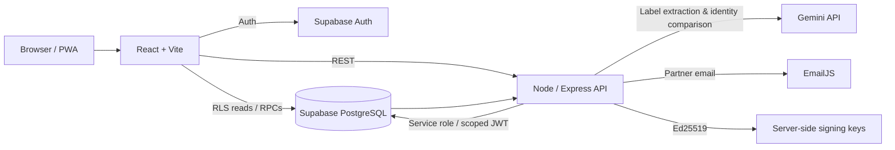

# GenuineNG — Full Application Architecture & Flow

> **Current system:** React/Vite PWA frontend + Node/Express backend + Supabase Auth/PostgreSQL + Gemini label extraction/comparison + Ed25519 signed unit QR codes + EmailJS partner notifications.
>
> This is the system-level handoff document. It describes how the current files are divided, how requests move between them, where state lives, and how Layer 1 and Layer 2 jointly achieve GenuineNG's product-verification goal.

---

## 1. Product model

GenuineNG deliberately has **two different verification layers** because printed label evidence and issuer-controlled unit identity are not the same thing.

### Layer 1 — Registry Label

Checks what can be supported from printed packaging:

```text
Product label photos
→ extract printed details
→ user reviews them
→ NAFDAC registration check
→ expiry check
→ evidence-based result
```

A Registry result can be incomplete. `Unverified` is not the same as fake.

### Layer 2 — GenuineNG Code

Checks whether an exact physical-unit QR belongs to GenuineNG's issuance system:

```text
Manufacturer/product/batch
→ unique unit
→ Ed25519 signature
→ QR
→ customer camera scan
→ signature + issuance + status check
→ Genuine / Not Genuine
```

The two layers share account/session/history UI, but they do not share verification rules.

---

## 2. High-level architecture



There are two kinds of Supabase clients by design:

- **Frontend client** — publishable/anon key + current user's session; RLS enforced.
- **Backend service-role client** — secret key; used only for operations that must not be callable directly from the browser.

Manufacturer authenticated routes additionally create a request-scoped Supabase client carrying the user's JWT so normal manufacturer reads/writes remain subject to RLS.

---

## 3. Application routes

### Public/customer routes

| Route | Purpose |
|---|---|
| `/` | Marketing/landing + public scan launcher |
| `/scan` | Guest Registry flow |
| `/code-scan` | Guest GenuineNG QR flow |
| `/login` | Sign in/sign up/forgot password |
| `/reset-password` | Supabase recovery-session password change |
| `/partners` | Manufacturer partner application |
| `/about` | Placeholder/current informational page |
| `/help` | Placeholder/current informational page |
| `/contact` | Placeholder/current informational page |

### Signed-in consumer routes

| Route | Purpose |
|---|---|
| `/app` | New unlocked check; Registry selected by default |
| `/app/:sessionId` | Reopen locked saved Registry or GenuineNG Code session |

### Manufacturer routes

| Route | Purpose |
|---|---|
| `/manufacturer` | Overview |
| `/manufacturer/products` | Product registry |
| `/manufacturer/batches` | Production batches |
| `/manufacturer/generate-codes` | Generate/resume signed unit codes + exports |
| `/manufacturer/scan-activity` | Verification activity |
| `/manufacturer/team` | Coming later |
| `/manufacturer/profile` | Company profile |

### Approval route

| Route | Purpose |
|---|---|
| `/admin/partner-approval?token=...` | Authenticated, allowlisted email approval link |

---

## 4. Full repository structure

```text
GenuineNG/
├── .gitignore
├── README.md
├── SETUP.md
├── TESTING_CHECKLIST.md
├── VALIDATION_REPORT.md
├── DEFERRED.md
├── PARTNER_APPROVAL_SETUP.md
├── package.json
├── package-lock.json
├── nafdac_greenbook_export.json
│
├── scripts/
│   ├── fetch-nafdac-greenbook.js
│   ├── generateKeyPair.js
│   └── validate-reference-data.js
│
├── frontend/
│   ├── .env.example
│   ├── .gitignore
│   ├── package.json
│   ├── package-lock.json
│   ├── index.html
│   ├── vite.config.js
│   ├── vercel.json
│   ├── public/
│   │   ├── manifest.json
│   │   ├── service-worker.js
│   │   ├── fonts/
│   │   │   ├── bricolage.woff
│   │   │   └── bricolage-LICENSE.txt
│   │   ├── icons/
│   │   │   ├── favicon.svg
│   │   │   ├── favicon2.svg
│   │   │   ├── icon-192.png
│   │   │   └── icon-512.png
│   │   └── images/
│   │       ├── hero1.webp
│   │       ├── hero2.webp
│   │       ├── hero3.webp
│   │       ├── hero4.webp
│   │       └── second-section-img.webp
│   └── src/
│       ├── main.jsx
│       ├── App.jsx
│       ├── styles/
│       │   └── index.css
│       ├── components/
│       │   ├── AuthMascots.jsx
│       │   ├── CameraCaptureDialog.jsx
│       │   ├── CheckModeSwitch.jsx
│       │   ├── CodeScanFlow.jsx
│       │   ├── ExtractionReviewDialog.jsx
│       │   ├── FieldReviewForm.jsx
│       │   ├── Hero.jsx
│       │   ├── Icon.jsx
│       │   ├── LabelCheckFlow.jsx
│       │   ├── ManufacturerSidebar.jsx
│       │   ├── NotificationBell.jsx
│       │   ├── OcrFailureDialog.jsx
│       │   ├── ResultView.jsx
│       │   ├── ScanCameraView.jsx
│       │   └── WhyGenuineNG.jsx
│       ├── pages/
│       │   ├── AdminPartnerApprovalPage.jsx
│       │   ├── GuestScanPage.jsx
│       │   ├── Layer2ScanPage.jsx
│       │   ├── LoginPage.jsx
│       │   ├── PartnerApplicationPage.jsx
│       │   ├── PlaceholderPage.jsx
│       │   ├── ResetPasswordPage.jsx
│       │   ├── ScanPage.jsx
│       │   ├── SignedWorkspacePage.jsx
│       │   └── manufacturer/
│       │       ├── GenerateCodesPage.jsx
│       │       ├── ManufacturerBatchesPage.jsx
│       │       ├── ManufacturerCompanyProfilePage.jsx
│       │       ├── ManufacturerDashboardPage.jsx
│       │       ├── ManufacturerPortalPage.jsx
│       │       ├── ManufacturerProductsPage.jsx
│       │       ├── ManufacturerSimplePage.jsx
│       │       └── ScanActivityPage.jsx
│       ├── services/
│       │   ├── api.js
│       │   ├── authService.js
│       │   ├── errorShape.js
│       │   ├── historyService.js
│       │   ├── labelPayload.js
│       │   ├── manufacturerApi.js
│       │   ├── notificationService.js
│       │   ├── partnerApprovalApi.js
│       │   ├── resultModel.js
│       │   ├── supabase.js
│       │   ├── labelPayload.test.js
│       │   ├── resultModel.test.js
│       │   └── verifySignature.test.js
│       ├── crypto/
│       │   └── verifySignature.js
│       ├── ocr/
│       │   └── imagePreprocess.js
│       └── speech/
│           └── voice.js
│
├── backend/
│   ├── .env.example
│   ├── .gitignore
│   ├── README.md
│   ├── package.json
│   ├── package-lock.json
│   ├── data/
│   │   └── processed/reference_products.json
│   └── src/
│       ├── server.js
│       ├── assets/
│       │   └── genuineng-icon.png
│       ├── config/
│       │   └── supabaseClient.js
│       ├── controllers/
│       │   ├── extractLabelController.js
│       │   ├── labelChecksController.js
│       │   ├── manufacturerController.js
│       │   ├── partnerApplicationController.js
│       │   ├── scansController.js
│       │   └── verifyCodeController.js
│       ├── middleware/
│       │   ├── authMiddleware.js
│       │   ├── errorHandler.js
│       │   ├── manufacturerAuthMiddleware.js
│       │   ├── optionalAuthMiddleware.js
│       │   ├── partnerAdminMiddleware.js
│       │   └── validation.js
│       ├── routes/
│       │   ├── extractLabel.js
│       │   ├── labelChecks.js
│       │   ├── manufacturer.js
│       │   ├── partnerApplications.js
│       │   ├── scans.js
│       │   └── verifyCode.js
│       ├── services/
│       │   ├── batchService.js
│       │   ├── codeGenerationService.js
│       │   ├── emailJsService.js
│       │   ├── expiryChecker.js
│       │   ├── exportService.js
│       │   ├── geminiMatcher.js
│       │   ├── keyManager.js
│       │   ├── labelExtractor.js
│       │   ├── partnerApprovalService.js
│       │   ├── productService.js
│       │   ├── qrGenerator.js
│       │   ├── referenceData.js
│       │   ├── registrationMatcher.js
│       │   ├── resultBuilder.js
│       │   ├── scanActivityService.js
│       │   ├── signer.js
│       │   └── *.test.js
│       └── validators/
│           ├── labelInputValidator.js
│           ├── manufacturerValidators.js
│           ├── partnerApplicationValidator.js
│           ├── scanInputValidator.js
│           └── verifyCodeValidator.js
│
└── supabase/
    ├── genuineng_reset.sql
    ├── genuineng_schema.sql
    ├── demo_manufacturer.sql
    └── migrations/
        ├── 001_genuineng_baseline.sql
        └── 002_partner_email_approval_notifications.sql
```

---

## 5. What each top-level file/folder does

### Root documentation

- `README.md` — project entry point and setup summary.
- `SETUP.md` — practical environment/database setup.
- `TESTING_CHECKLIST.md` — manual end-to-end verification plan.
- `VALIDATION_REPORT.md` — validation/test status recorded during the cleanup pass.
- `DEFERRED.md` — intentionally postponed work.
- `PARTNER_APPROVAL_SETUP.md` — EmailJS/admin approval configuration.

### Root data/scripts

- `nafdac_greenbook_export.json` — Layer 1 Registration reference source loaded at backend startup.
- `fetch-nafdac-greenbook.js` — refreshes reference data.
- `validate-reference-data.js` — validates reference file structure.
- `generateKeyPair.js` — creates Ed25519 key pair for Layer 2 signing.

---

## 6. Frontend responsibilities by file group

### Application shell

#### `src/main.jsx`

Mounts React, imports global CSS, and registers the service worker only in production.

#### `src/App.jsx`

Central route coordinator. It handles:

- Supabase Auth session tracking;
- public vs signed-in routes;
- manufacturer-route protection handoff;
- partner approval-route sign-in return;
- online/offline state;
- backend health;
- PWA install prompt;
- public header/nav/footer;
- guest result state;
- responsive install control.

The top header's install button keeps full `+ Install as app` text when space allows and collapses to a compact `+` when the authenticated header becomes crowded.

### Shared scan engine

#### `LabelCheckFlow.jsx`

Owns signed/guest mode selection and Registry state machine. When mode is `code`, it delegates to `CodeScanFlow`.

#### `CheckModeSwitch.jsx`

Pure mode toggle. It does not decide whether switching is allowed; its `locked` prop comes from the parent flow.

#### `CodeScanFlow.jsx`

Owns Layer 2 camera scanner and QR result view.

### Layer 1 supporting components

- `CameraCaptureDialog.jsx` — product image capture.
- `ExtractionReviewDialog.jsx` — extracted-field review shell.
- `FieldReviewForm.jsx` — editable printed fields.
- `OcrFailureDialog.jsx` — extraction failure/manual fallback.
- `ResultView.jsx` — Layer 1 result presentation/actions.
- `ScanCameraView.jsx` — public Registry launcher/camera presentation.

### Product/site components

- `Hero.jsx` — landing hero and typing treatment.
- `WhyGenuineNG.jsx` — explanatory section.
- `AuthMascots.jsx` — sign-in visual behavior.
- `Icon.jsx` — centralized inline icon renderer.

### Manufacturer components

- `ManufacturerSidebar.jsx` — portal navigation, collapse/mobile behavior, consumer-workspace link and sign-out.
- `NotificationBell.jsx` — signed-in notification UI shared across public header/workspace.

---

## 7. Frontend page responsibilities

### `ScanPage.jsx`

Landing-page scan selector. Registry launches product-photo capture; GenuineNG Code embeds the QR scanner.

### `GuestScanPage.jsx`

Guest Registry wrapper. No persistent database history.

### `Layer2ScanPage.jsx`

Guest QR wrapper.

### `LoginPage.jsx`

Sign-in/sign-up UI and forgot-password entry point. Auth operations are delegated to `authService.js`.

### `ResetPasswordPage.jsx`

Accepts Supabase recovery state in several supported URL forms:

- PKCE `code`;
- access + refresh token;
- recovery `token_hash`.

Once a valid recovery session exists, it submits the new password through Supabase Auth and returns the user to sign-in.

### `SignedWorkspacePage.jsx`

Authenticated consumer workspace and history coordinator.

### `PartnerApplicationPage.jsx`

Public four-field manufacturer application form.

### `AdminPartnerApprovalPage.jsx`

Secure email approval landing page. It reviews the token, then performs approval after authenticated/allowlisted access is established.

### `PlaceholderPage.jsx`

Temporary About/Help/Contact content.

### Manufacturer pages

- `ManufacturerPortalPage.jsx` — portal shell and approved-manufacturer client gate.
- `ManufacturerDashboardPage.jsx` — overview metrics/recent activity.
- `ManufacturerProductsPage.jsx` — product CRUD for current release.
- `ManufacturerBatchesPage.jsx` — batch creation/listing.
- `GenerateCodesPage.jsx` — actual generation progress and exports.
- `ScanActivityPage.jsx` — verification/reuse/revocation analytics.
- `ManufacturerCompanyProfilePage.jsx` — approved company details.
- `ManufacturerSimplePage.jsx` — Team coming-later state.

---

## 8. Frontend service responsibilities

### `services/supabase.js`

Creates the browser Supabase client and exposes display-name helper.

Auth settings persist/refresh sessions and detect sessions in incoming URLs, which is required for password recovery.

### `services/authService.js`

Direct Supabase Auth operations:

- password sign-in;
- sign-up;
- password reset email;
- password update;
- sign-out.

### `services/api.js`

Public/common backend calls:

- label extraction;
- Registry verification;
- backend health;
- code verification.

When verifying a QR it includes the current bearer token if present; that allows the backend to identify an owning manufacturer without making public scanning require authentication.

### `services/historyService.js`

Unified signed-in session/history layer for both scan types.

It knows how to translate:

```text
scans + scan_checks → Registry result model
code_scans → GenuineNG Code result model
```

### `services/manufacturerApi.js`

Manufacturer REST client with bearer auth and short-lived read cache.

### `services/partnerApprovalApi.js`

Authenticated review/approve calls for the email token route.

### `services/notificationService.js`

RLS-protected reads/updates of the current user's in-app notifications.

### `services/labelPayload.js`

Layer 1 field normalization.

### `services/resultModel.js`

Layer 1 result interpretation and wording.

### `services/errorShape.js`

Normalizes error messages across different backend response shapes.

---

## 9. Backend request pipeline

`server.js` establishes common behavior:

```text
Load environment
→ validate required secrets/keys
→ configure CORS
→ configure rate limits
→ JSON parsing + compression
→ request logging
→ register routes
→ 404 handling
→ upload-specific errors
→ general error handler
```

### CORS

`FRONTEND_ORIGIN` supports comma-separated allowed origins. Vercel preview origins matching the GenuineNG project pattern are also accepted.

### Rate limits

General API:

```text
30 requests / 15 minutes
```

Manufacturer API:

```text
240 requests / 15 minutes
```

The higher manufacturer allowance is necessary because a 100,000-unit batch can require up to 100 generation-chunk requests.

---

## 10. Backend controller/service split

Controllers handle HTTP translation; services hold reusable business logic.

### Layer 1

```text
extractLabelController
→ labelExtractor

labelChecksController
→ resultBuilder
   ├─ registrationMatcher
   │  ├─ referenceData
   │  └─ geminiMatcher
   └─ expiryChecker

scansController
→ database save_label_scan RPC
```

### Layer 2

```text
verifyCodeController
├─ verifyCodeValidator
├─ signer.verifySignature
└─ database anti-reuse/manufacturer RPC

manufacturerController
├─ productService
├─ batchService
├─ codeGenerationService
├─ exportService
└─ scanActivityService

partnerApplicationController
├─ partnerApplicationValidator
├─ partnerApprovalService
├─ emailJsService
└─ database approval RPC
```

---

## 11. Shared signed-in session architecture

This is one of the most important cross-layer systems.

### New session

```text
/app
→ no database session yet
→ Registry selected by default
→ user may switch modes
```

### First action locks mode

Registry:

```text
upload/capture image
→ modeLocked = true
```

GenuineNG Code:

```text
open camera
→ onStart()
→ modeLocked = true
```

### First successful save creates the database session

Layer 1 calls `save_label_scan`, which creates `registry_label` session if no ID exists.

Layer 2 calls `save_code_scan`, which creates `genuine_code` session if no ID exists.

The workspace then navigates from:

```text
/app
```

to:

```text
/app/<session UUID>
```

### Reopen

`historyService.getSessionWithScans()` first reads the session mode, then loads only the corresponding child table.

### New Check

The workspace clears current thread state and increments the component key. This ensures a previously locked local flow cannot leak into the next unsaved check.

---

## 12. Authentication flows

### Normal user

```text
Supabase Auth
→ session persisted in browser
→ /app history protected by RLS/backend bearer checks
```

### Password reset

```text
Forgot password
→ Supabase resetPasswordForEmail()
→ /reset-password
→ establish recovery session
→ updateUser(password)
→ sign in
```

Required Supabase redirect URLs should include both local and deployed reset routes during development.

### Manufacturer

```text
Normal Supabase account
→ manufacturers row tied to user_id
→ approved = true
→ /manufacturer UI gate
→ every manufacturer REST call rechecks bearer token + approved manufacturer
→ RLS enforces ownership
```

---

## 13. Partner approval and EmailJS

EmailJS is used as a transport, not as the authorization system.

### Application email

Backend receives public application and sends template variables including:

```text
company_name
contact_person_name
business_email
phone_number
application_id
submitted_at
status
approval_url
```

### Approval button

`approval_url` points to:

```text
< PUBLIC_APP_URL >/admin/partner-approval?token=<one-time-token>
```

### Authorization after click

The backend additionally requires:

- valid Supabase session;
- signed-in email in `PARTNER_ADMIN_EMAILS`;
- valid unused token;
- unexpired token;
- pending application.

### Completion

Approval creates manufacturer access, in-app notification and applicant approval email.

---

## 14. PWA behavior

### `public/manifest.json`

Defines standalone GenuineNG install metadata, icons and brand colors.

### `public/service-worker.js`

Caches the application shell and same-origin GET assets. API requests are deliberately excluded. Navigation requests try network first and fall back to cached `index.html`.

This means the shell can still open under limited connectivity, but verification/history operations still require the live backend/Supabase services.

### Install prompt

`App.jsx` captures `beforeinstallprompt` and exposes it through public and workspace UI.

---

## 15. Environment separation

### Frontend `.env.local`

```env
VITE_API_BASE_URL=http://localhost:4000
VITE_SUPABASE_URL=
VITE_SUPABASE_ANON_KEY=
VITE_EMAILJS_SERVICE_ID=
VITE_EMAILJS_TEMPLATE_ID=
VITE_EMAILJS_PUBLIC_KEY=
```

The `VITE_*` variables are browser-visible by design. Never place service-role or signing-private keys there.

### Backend `.env`

Core:

```env
PORT=4000
FRONTEND_ORIGIN=http://localhost:4173,https://genuine-ng.vercel.app
PUBLIC_APP_URL=https://genuine-ng.vercel.app
GEMINI_API_KEY=
SUPABASE_URL=
SUPABASE_PUBLISHABLE_KEY=
SUPABASE_SECRET_KEY=
GENUINENG_ED25519_PRIVATE_KEY=
GENUINENG_ED25519_PUBLIC_KEY=
GENUINENG_KEY_VERSION=1
MANUFACTURER_PORTAL_ENABLED=true
```

Partner email approval:

```env
EMAILJS_SERVICE_ID=
EMAILJS_PUBLIC_KEY=
EMAILJS_PARTNER_APPLICATION_TEMPLATE_ID=
EMAILJS_PARTNER_APPROVED_TEMPLATE_ID=
PARTNER_ADMIN_EMAILS=
PARTNER_APPROVAL_TOKEN_HOURS=72
```

`FRONTEND_ORIGIN` may contain multiple comma-separated CORS origins. `PUBLIC_APP_URL` should contain one canonical URL because it is concatenated into links.

---

## 16. How GenuineNG achieves its goal

The system reduces ambiguity by keeping different kinds of evidence separate.

### For an ordinary product without a GenuineNG-issued QR

Layer 1 gives the user a structured check of the printed registration and expiry information. It tells them exactly what matched, what warned, and what could not be checked.

### For a product carrying a GenuineNG unit QR

Layer 2 adds issuer-controlled evidence:

- a unique unit identity;
- a cryptographic signature;
- a server-side issuance record;
- a current active/revoked state;
- anti-reuse event history.

### For manufacturers

The portal turns that same trust model into a production workflow:

```text
Company approval
→ product registration
→ batch creation
→ unit generation/signing
→ production exports
→ field scans
→ reuse/revocation analytics
```

### For the platform operator

Manual manufacturer approval, an admin email allowlist, one-time token hashes, service-role-only state mutations and RLS give the release a controlled trust boundary without requiring a large admin product yet.

---

## 17. Critical invariants across the entire app

1. **Layer 1 `Unverified` never means fake.**
2. **Missing expiry produces `Not checked`.**
3. **One scan session has one immutable type.**
4. **New Check always starts unlocked.**
5. **Guest checks do not create persistent history.**
6. **Signed-in history belongs only to that user.**
7. **Layer 2 final verdict is Genuine or Not Genuine; reuse is separate.**
8. **Ed25519 private key remains backend-only.**
9. **A valid signature must still match an issued database unit.**
10. **Third public scan revokes one unit; fourth+ is Not Genuine.**
11. **Manufacturer scans do not consume public reuse count.**
12. **Manufacturer A cannot cross into Manufacturer B's data.**
13. **Generation progress is derived from stored unit rows.**
14. **Incomplete batches cannot export.**
15. **Partner approval requires both secure token and authorized signed-in admin.**
16. **The database remains the authority for ownership, atomic counters and approval state.**

---

## 18. Current known deployment dependency

If partner application submission returns:

```text
Could not find the 'approval_token_expires_at' column of 'manufacturer_applications'
```

then the frontend/backend code is ahead of the currently applied database schema.

For a database that already has the clean baseline, apply only:

```text
supabase/migrations/002_partner_email_approval_notifications.sql
```

Do not perform another destructive reset just to add the approval-token/notification patch.

---

## 19. Testing order for the complete system

A useful full-system test sequence is:

```text
1. Backend health
2. Auth signup/sign-in
3. Guest Layer 1
4. Signed Layer 1 + history
5. New Check mode reset
6. Guest Layer 2
7. Partner application
8. Admin approval email/link
9. Applicant in-app + email notification
10. Manufacturer portal access
11. Product creation/edit
12. Batch creation
13. 5–10 unit generation
14. QR ZIP/CSV/manifest
15. Scan one generated code #1, #2, #3, #4
16. Confirm manufacturer activity
17. Save/reopen QR history
18. Cross-user and cross-manufacturer access checks
19. Password recovery
20. Production build + mobile/PWA checks
```

That order follows the application's actual dependencies instead of testing isolated pages randomly.
